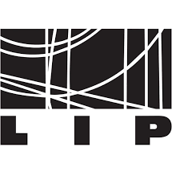

# A set of Common Service Quality Assurance Baseline Criteria for Research Projects

    
    
    

## Motivation

Service development, provisioning, operation and integration into large
scale production infrastructures often suffers from a lack of
quality assurance realization. This might result from the fact that the
different actors involved are either not aware of the benefits that applying
quality practices bring along, or not keen to adhere to them as they might
increase the burden of service deployment, operation and management.
Thus, the main purpose of this
document is to _provide a lightweight and practical approach_ to educate and,
ultimately, achieve quality of those services, such as their stability or
functional suitability..

The Common Service Quality Assurance Baseline Criteria
_establishes the minimum viable set of quality requirements_ provides an initial
approach to Service Quality Assurance, meant to be applied in the integration
process of the services existing under the EOSC-Synergy project, which eventually
will be accessible as part of the EOSC offerings. In
order to discern among them, the [RFC 2119](https://www.ietf.org/rfc/rfc2119.txt)
convention is used throughout the document, thus adding adequate information
about the criticality of each requirement.

_A citable version of this manuscript is available at https://digital.csic.es/handle/10261/214441_

## Open Collaboration

The current baseline has been elaborated based on the first-hand
experiences extracted from several European-funded research projects for
service provisioning, operation and integration into large scale production
infrastructures. We aim to consolidate the quality guidelines as a
reference point for current and future research infrastructures, setting a
path for sustainability and knowledge transfer. This goal can only be achieved
through a open and collaborative effort. Consequently, __any contribution
is welcomed and will be considered for inclusion.__

Please check our [contribution](CONTRIBUTING.md) guide.

## Copyright Notice

Copyright © Members of the EOSC-Synergy collaborations, 2019-2020.

## License

The Common Software Quality Assurance Baseline Criteria is licensed under a
CC-BY SA 4.0. See [`LICENSE.md`](LICENSE.md).

## Acknowledgment

The EOSC-Synergy project has received funding from the European Union’s Horizon
2020 research and innovation programme under grant agreement number 857647.

  

###### _Manuscript generated with [Manubot](https://greenelab.github.io/manubot-rootstock/)_
