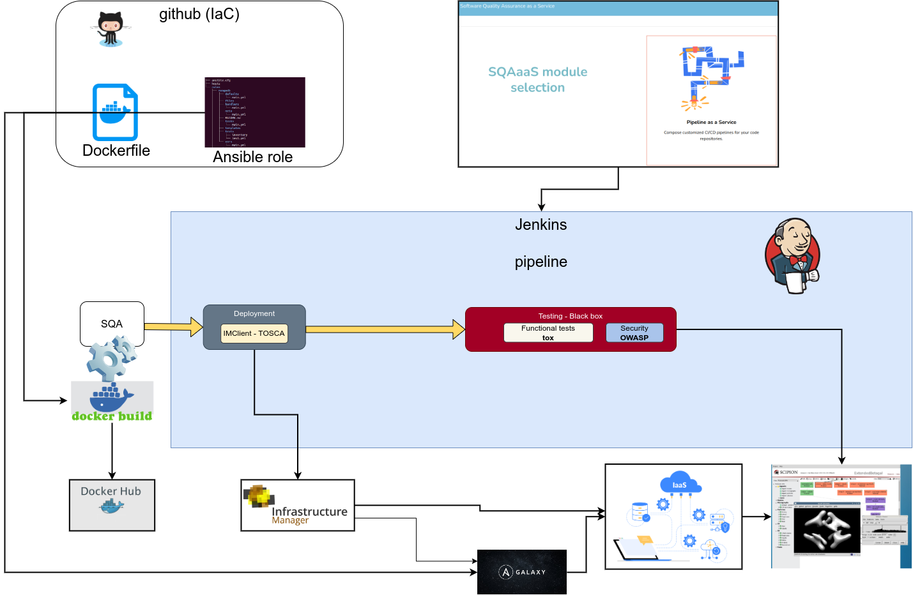

# A1. Annex {.page_break_before}

The Quality Criteria described in this document follows a technology-agnostic approach. As such the
choice of tools and services to implement the workflow for service quality assessment process, is up
to the team or community developing or operating a given service.

This annex describes an implementation approach to help service developers and operators, cover the
Quality Criteria detailed in this document.

## A1.1. Code workflow

The workflow for service quality assessment, is shown in Figure @fig:workflow. It depicts a real
case example, GitHub is used in particular to host the Dockerfiles to build the service Docker
image, it also hosts the Ansible role for the service deployment and configuration, thus the
IaC (Infrastructure as Code).

The SQA as a Service (SQAaaS), is used to create the Jenkinsfile (pipeline) to be executed in the
Jenkins service.

Before the Jenkins pipeline execution phase, the figure depicts the build and upload/publish of the
service Docker image in the Docker Hub.

The Jenkins service is the main service used to execute he pipeline. The figure show a simple
pipeline with automated deployment of the service, execution of functional tests and dynamic
security tests, but in general the pipeline can be more complex and execute other tools to assess
the other service quality criteria.

The bottom part of the figure shows the services, tools and infrastructures that are actuated by the
Jenkins pipeline execution: The [IM (Infrastructure Manager)](https://www.grycap.upv.es/im) is the
service that is used to deploy the service in cloud resources, fetching the corresponding Ansible
role from Ansible Galaxy to instantiate and configure it.

{height="700px"}{#fig:workflow}

## A1.2. Services

As it can be seen in Figure @fig:workflow, multiple services take part in the execution of the CI/CD
pipelines. Table 1 shows the list of services used for the service for the Quality Criteria
assessment detailed in this document.

One of the most popular services for Software source code management is GitHub. It is uses Git
as the Version Control System, branching and tag management.

Ansible and Ansible-Galaxy are used in many software frameworks as deployment and configuration
tools.

The software is packed/built into executable artifacts that can be RPMs (case of RedHat and
derivative OS), DEBs (case of Debian/Ubuntu and derivatives) and in many cases containers such as
Docker images.

The artifacts are provided, in general, by public repositories and most notably Docker Hub
[@url:https://hub.docker.com/] in the case of Docker images.

Regarding the CI/CD automation, Jenkins pipelines can be easily composed through the SQAaaS platform
and put into the git repositories to be used by the Jenkins CI service to perform the tests. The
tools used in the CI automation are shown in section A1.2.

Kubernetes is a container management platform where services or platforms can be deployed while the
IM (Infrastructure Manager) can also be used to automatically deploy services both in cloud
resources or kubernetes clusters.

| Service                     | Usage                         | Criteria      |  Repo URL or documentation               | Comment                                  |
|-----------------------------|-------------------------------|---------------|------------------------------------------|------------------------------------------|
| GitHub                      | VCS                           | **SvcQC.Dep** | <https://docs.github.com/>               | Source code repository - git             |
| Ansible, Galaxy             | Install, Config               | **SvcQC.Dep** | <https://docs.ansible.com/>              | Automated deployment and configuration   |
| SQAaaS platform             | Pipeline composition          | **All**       | <https://sqaaas.eosc-synergy.eu>         | Pipeline composition for automatic tests |
| SQAaaS platform             | Assessment & awarding         | **All**       | <https://sqaaas.eosc-synergy.eu>         | Badge awarding                           |
| Jenkins CI service          | Automated tests               | **All**       | <https://www.jenkins.io/>                | Execution of automatic tests             |
| Docker Hub                  | Docker images                 | N.A.          | <https://hub.docker.com/>                | Public repository of Docker images       |
| Kubernetes                  | Service deployment/management |**SvcQC.Dep**  | <https://kubernetes.io/>                 | Docker container management              |
| Infrastructure Manager (IM) | Service deployment            |**SvcQC.Dep**  | <https://www.grycap.upv.es/im> | Service deployment                       |

Table 1: Tools and services used to implement the Service QA criteria, also shown the criteria where
applicable.

## A1.3. Tools for CI/CD

This section shows the tools being used in the CI pipelines and the criteria that it verifies. This
list is based on the template file in
<https://github.com/EOSC-synergy/sqa-composer-templates/blob/main/tooling.json>.

| Tool       | Criteria      | Language   | Repo URL or documentation                             | Summary                  |
|------------|---------------|------------|-------------------------------------------------------|--------------------------|
| kubectl    | **SvcQC.Dep** | Agnostic   | <https://kubernetes.io/docs/tasks/tools/>             | Automated deployment     |
| im_client  | **SvcQC.Dep** | RADL/TOSCA | <https://imdocs.readthedocs.io/en/latest/client.html> | Automated deployment     |
| ec3_client | **SvcQC.Dep** | RADL/TOSCA | <https://github.com/grycap/ec3>                       | Automated deployment     |
| tox        | **SvcQC.Fun** | Python     | <https://tox.readthedocs.io/>                         | Automated test framework |
